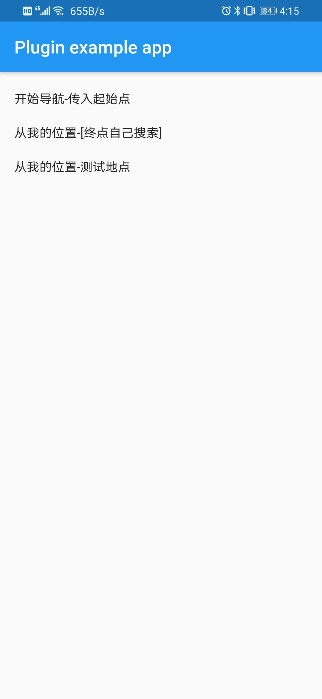
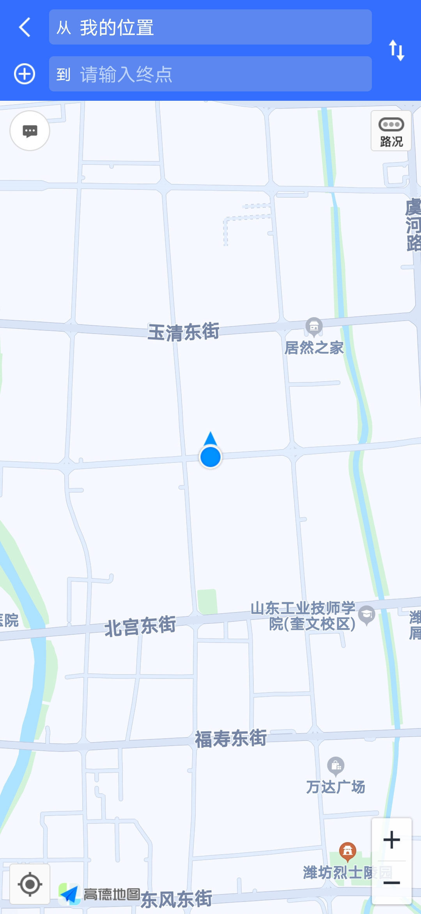
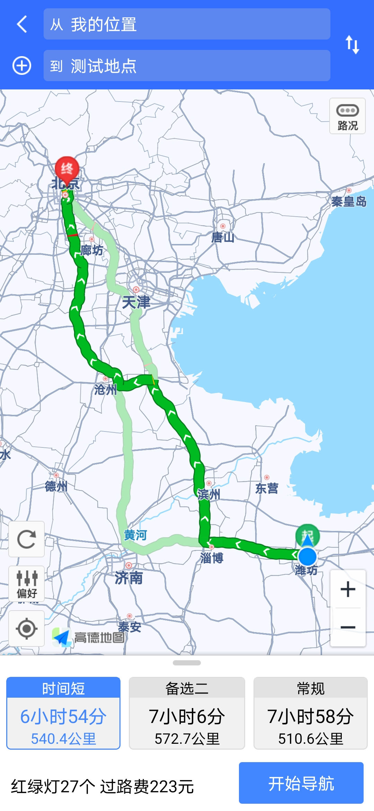
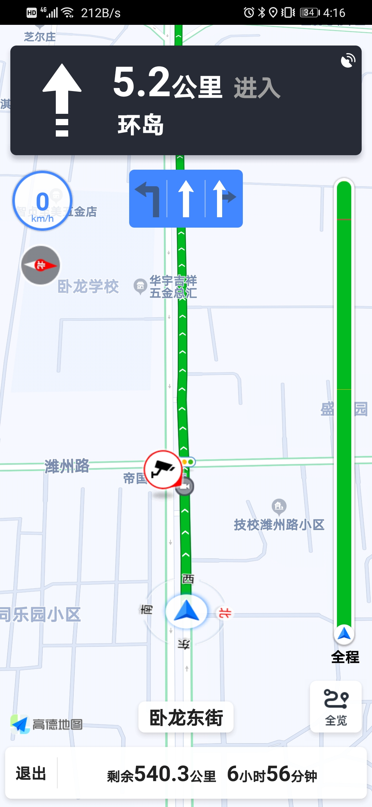

# amap_flutter_navi

Flutter高德地图导航，基于[高德开放平台导航SDK]开发高德导航插件。

## 效果图

|     |   |    |    |
|  ----  | ----  | ---- | ---- |
|   |  |   |  |

## 基本使用示例

```dart
  @override
  void initState() {
    super.initState();
    // ios配置，android的在AndroidManifest.xml中配置
    AmapFlutterNavi.init('432f2117dc752c4a499dbd0ff76e7a87');
  }
   Widget item(String title, VoidCallback callback) {
    return InkWell(
      onTap: callback,
      child: Container(
        margin: EdgeInsets.only(top: 20),
        child: Text(title),
      ),
    );
  }
  @override
  Widget build(BuildContext context) {
    return MaterialApp(
      home: Scaffold(
        appBar: AppBar(
          title: const Text('Plugin example app'),
        ),
        body: ListView(
          padding: EdgeInsets.only(left: 16),
          children: <Widget>[
            item('开始导航-传入起始点', () {
              LatLng fromLatLng = LatLng(40.065074, 116.22662);
              LatLng toLatLng = LatLng(39.963175, 116.42669);
              AmapFlutterNavi.startNavi(fromLatLng, toLatLng);
            }),
            item('从我的位置-[终点自己搜索]', () {
              AmapFlutterNavi.startNaviByEnd();
            }),
            item('从我的位置-测试地点', () {
              LatLng toLatLng = LatLng(39.963175, 116.42669);
              AmapFlutterNavi.startNaviByEnd(toLatLng, '测试地点');
            }),
          ],
        ),
      ),
    );
  }
```

## 插件使用注意问题
- 要在官方控制台添加应用，分别设置ios和android的key
###  android 
- app build.gradle
```
  buildTypes {
        release {
            // TODO: Add your own signing config for the release build.
            // Signing with the debug keys for now, so `flutter run --release` works.
            ......
            //关闭混淆, 否则在运行release包后可能出现运行崩溃
            minifyEnabled false //删除无用代码
            shrinkResources false //删除无用资源
       }
   .....
  }
```
- AndroidMainfest.xml配置
```xml
    // 权限设置
    <uses-permission android:name="android.permission.INTERNET" />
    <uses-permission android:name="android.permission.WRITE_EXTERNAL_STORAGE" />
    <uses-permission android:name="android.permission.ACCESS_COARSE_LOCATION" />
    <uses-permission android:name="android.permission.ACCESS_NETWORK_STATE" />
    <uses-permission android:name="android.permission.ACCESS_FINE_LOCATION" />
    <uses-permission android:name="android.permission.READ_PHONE_STATE" />
    <uses-permission android:name="android.permission.CHANGE_WIFI_STATE" />
    <uses-permission android:name="android.permission.ACCESS_WIFI_STATE" />
    <uses-permission android:name="android.permission.WAKE_LOCK" />
    <uses-permission android:name="android.permission.READ_EXTERNAL_STORAGE" />
    <uses-permission android:name="android.permission.BLUETOOTH" />

    // 新增配置
    <meta-data
            android:name="com.amap.api.v2.apikey"
            android:value="你的key" />

    // 新增配置
    <activity
        android:name="com.amap.flutter.amap_flutter_navi.activity.EmulatorActivity"
        android:configChanges="orientation|keyboardHidden|screenSize"
        android:label="高德导航"
        android:theme="@android:style/Theme.Light.NoTitleBar" />
```

### ios配置
- Background Model中添加Location updates配置项
- info中添加

```xml
    <key>NSLocationAlwaysAndWhenInUseUsageDescription</key>
	<string>test</string>
	<key>NSLocationWhenInUseUsageDescription</key>
	<string>test</string>
    <key>io.flutter.embedded_views_preview</key>
	<true/>
```


